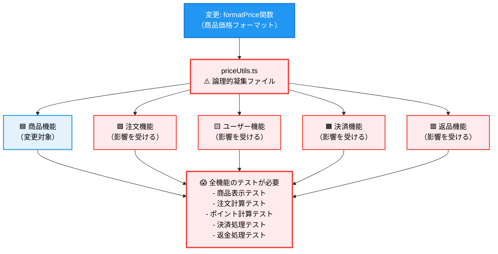
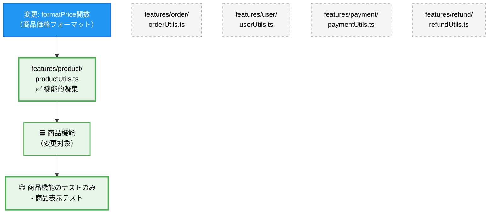

## はじめに
こんにちは、RAOです。

こちらは HRBrain Advent Calendar 2025 の19日目の記事です。

https://adventar.org/calendars/12091

フロントエンド開発において、プロジェクトが大規模化するにつれて、以下のようなコードの保守性や可読性が課題となることがよくあると思います。

- 「この機能を修正したいが、関連するファイルがどこにあるのか分からない」
- 「新しい機能を追加する際、ファイルをどこに配置すべきか迷う」
- 「コンポーネントが複雑になりすぎて、テストやデバッグが困難」
- 「チーム開発で、他の人が書いたコードの意図を理解するのに時間がかかる」

これらの問題の根本的な原因の一つは、**凝集度**の低い設計にあります。

**凝集度**とは、ソフトウェア工学における重要な概念で、モジュール内の要素がどれだけ密接に関連し合っているかを表す指標です。高凝集度な設計では、関連性の高い機能がまとまっており、低凝集度な設計では、関連性の薄い機能が混在しています。

本記事では、凝集度の概念をReactアプリケーションのディレクトリ設計に適用し、保守性・拡張性・可読性の高いフロントエンドアプリケーションを構築する方法を解説します。

## 凝集度とは何か

### 凝集度の種類と特徴
大きく7段階に分類されます。詳細はサイバーエージェントさんの新卒研修資料[^1]が分かりやすいので詳細は省略しますが、以下のイメージで問題無いと思います。


| レベル | 凝集度の種類 | 特徴 | 凝集度 |
|--------|------------|------|------|
| 1 | 偶然的凝集 | 関連性のない要素が偶然まとまっている状態 | ❌ 低い |
| 2 | 論理的凝集 | 似たような処理をまとめているが、実際の関係は薄い状態 | ↕️ |
| 3 | 時間的凝集 | 同じタイミングで実行される処理をまとめた状態 | ↕️ |
| 4 | 手順的凝集 | 処理の順序に基づいてまとめられた状態 | ↕️ |
| 5 | 連絡的凝集 | 同じデータを扱う処理がまとまっている状態 | ↕️ |
| 6 | 情報的凝集 | 同じデータ構造を操作する処理がまとまっている状態 | ↕️ |
| 7 | 機能的凝集 | 単一の明確な目的を持つ処理がまとまっている状態 | ✅ 高い |

Webフロントエンドにおいては、論理的凝集と機能的凝集について考える機会が多いのでこの２つをピックアップします。

## ディレクトリ設計における機能的凝集度

### よくある論理的凝集への変化パターン

機能追加と共に、論理的凝集に陥ってしまう典型的なパターンを見てみましょう。

ECサイトの機能を例にします。

#### フェーズ1: 最初
最初は、機能が少ないため自然と機能的凝集になっています。各ファイルが単一の責任を持ち、理想的な状態です。

**画面イメージ：**

※今後画像イメージが複数登場しますが、あくまでイメージです。


**ディレクトリ構成：**

```
src/
├── components/
│   └── UserProfile.tsx     # ユーザープロフィール表示のみ
├── hooks/
│   └── useUser.ts          # ユーザー情報の取得・更新のみ
└── utils/
    └── userUtils.ts        # ユーザー関連のユーティリティのみ
```

#### フェーズ2: 商品機能追加

新しい機能（商品一覧）を追加しても、まだ各ファイルの責任は明確です。技術的分類でのディレクトリ構成でも問題ありません。

**画面イメージ：**


**ディレクトリ構成：**

```
src/
├── components/
│   ├── UserProfile.tsx
│   └── ProductCard.tsx     # 商品表示のみ
├── hooks/
│   ├── useUser.ts
│   └── useProduct.ts       # 商品情報の取得・更新のみ
└── utils/
    ├── userUtils.ts
    └── productUtils.ts     # 商品関連のユーティリティのみ
```

#### フェーズ3: カート機能追加
カート機能追加時、価格に関する処理を`priceUtils.ts`としてまとめ始めます。この時点では問題無いように見えますが、論理的凝集の種が蒔かれています。

**画面イメージ：**


**ディレクトリ構成：**

```
src/
├── components/
│   ├── UserProfile.tsx
│   ├── ProductCard.tsx
│   └── CartItem.tsx        # カート表示のみ
├── hooks/
│   ├── useUser.ts
│   ├── useProduct.ts
│   └── useCart.ts          # カート操作のみ
└── utils/
    ├── userUtils.ts
    ├── productUtils.ts
    └── priceUtils.ts       # ← ここから論理的凝集が始まる
```

```typescript
// utils/priceUtils.ts - 最初は商品価格のフォーマットだけ
export const formatPrice = (price: number) => {
  return new Intl.NumberFormat('ja-JP', {
    style: 'currency',
    currency: 'JPY'
  }).format(price);
};
```

#### フェーズ4: 注文機能追加

注文機能の追加で「価格関連だから」という理由で無関係な計算処理が`priceUtils.ts`に混入し始めます。ファイルの責任が曖昧になってきます。

**画面イメージ：**


**ディレクトリ構成：**

```
src/
├── components/
│   ├── UserProfile.tsx
│   ├── ProductCard.tsx
│   ├── CartItem.tsx
│   └── OrderSummary.tsx    # 注文サマリー表示
├── hooks/
│   ├── useUser.ts
│   ├── useProduct.ts
│   ├── useCart.ts
│   └── useOrder.ts         # 注文処理
└── utils/
    ├── userUtils.ts
    ├── productUtils.ts
    └── priceUtils.ts       # ← ここに無関係な機能が混入
```

```typescript
// utils/priceUtils.ts - 関係ない機能が追加され始める
export const formatPrice = (price: number) => { /* ... */ };

// 注文機能追加時に「価格関連だから」という理由で追加
export const calculateTax = (price: number) => price * 0.1;
export const calculateShipping = (items: CartItem[]) => { /* ... */ };

// 割引機能追加時に「価格計算だから」という理由で追加
export const applyDiscount = (price: number, discountRate: number) => { /* ... */ };
```

#### フェーズ5: 決済・レビュー機能追加

さらなる機能追加により、表面的な共通点だけで無関係な機能が一つのファイルに集まった状態です。保守性・可読性が大幅に低下しています。

**画面イメージ：**


**ディレクトリ構成：**

```
src/
├── components/
│   ├── UserProfile.tsx
│   ├── ProductCard.tsx
│   ├── CartItem.tsx
│   ├── OrderSummary.tsx
│   ├── PaymentForm.tsx     # 決済フォーム
│   └── ReviewForm.tsx      # レビューフォーム
├── hooks/
│   ├── useUser.ts
│   ├── useProduct.ts
│   ├── useCart.ts
│   ├── useOrder.ts
│   ├── usePayment.ts       # 決済処理
│   └── useReview.ts        # レビュー処理
└── utils/
    ├── userUtils.ts
    ├── productUtils.ts
    ├── priceUtils.ts       # ← 完全に関係ない機能の寄せ集めに
    └── validationUtils.ts  # ← 新たな論理的凝集ファイル
```

```typescript
// utils/priceUtils.ts - 「価格」「計算」という名前だけで無関係な機能が集まった状態

// 🟦 商品機能に関する処理
export const formatPrice = (price: number) => { /* 商品価格フォーマット */ };

// 🟩 注文機能に関する処理
export const calculateTax = (price: number) => { /* 税金計算 */ };
export const calculateShipping = (items: CartItem[]) => { /* 送料計算 */ };
export const applyDiscount = (price: number, rate: number) => { /* 割引適用 */ };

// 🟨 ユーザー機能に関する処理
export const calculatePoints = (price: number) => { /* ポイント計算 */ };

// 🟧 決済機能に関する処理
export const splitPayment = (total: number, methods: PaymentMethod[]) => { /* 分割払い計算 */ };

// 🟥 返品機能に関する処理
export const calculateRefund = (order: Order) => { /* 返金計算 */ };

// utils/validationUtils.ts - 「バリデーション」という名前だけで無関係な機能が集まった状態

// 🟦 ユーザー機能に関する処理
export const validateEmail = (email: string) => { /* メール形式チェック */ };
export const validatePassword = (password: string) => { /* パスワード強度チェック */ };

// 🟩 決済機能に関する処理
export const validateCreditCard = (number: string) => { /* クレジットカード番号チェック */ };
export const validatePostalCode = (code: string) => { /* 郵便番号チェック */ };

// 🟨 商品機能に関する処理
export const validateProductName = (name: string) => { /* 商品名チェック */ };

// 🟧 レビュー機能に関する処理
export const validateReviewText = (text: string) => { /* レビュー内容チェック */ };
```

このように、一つのファイルに複数の機能（🟦🟩🟨🟧🟥）が混在していることが分かります。これが論理的凝集の典型的な問題です。

### 論理的凝集の問題点

論理的凝集になったファイルは表面的な共通点はあるものの、実際には異なるビジネス機能に属しており、変更理由や変更タイミングが異なるため様々な問題を引き起こします。

上記の例で、最終的に `priceUtils.ts` と `validationUtils.ts` は論理的凝集になってしまいました：

**priceUtils.ts の問題：**
- 商品価格フォーマット（商品機能）
- 税金・送料計算（注文機能）
- ポイント計算（ユーザー機能）
- 分割払い計算（決済機能）
- 返金計算（返品機能）

これらは「価格計算」という表面的な共通点はあるものの、実際には異なるビジネス機能に属しており、変更理由も変更タイミングも異なります。

**実際に起こる問題：**
1. **影響範囲の拡大**: 商品の価格表示を変更したいだけなのに、決済・返金機能のテストも必要になる
2. **並行開発の阻害**: 複数チームが同じファイルを同時に変更してコンフリクトが発生
3. **理解の困難**: 新しいメンバーが「なぜこれらの機能が一つのファイルにあるのか」理解できない

#### 影響範囲の可視化

以下の図は、「商品の価格表示フォーマットを変更したい」というシナリオで、論理的凝集と機能的凝集での影響範囲の違いを示しています。

**❌ 論理的凝集の場合：影響範囲が広範囲に及ぶ**



**✅ 機能的凝集の場合：影響範囲が限定的**



この図から、機能的凝集では変更の影響範囲が商品機能内に限定され、他の機能のテストが不要になることが分かります。

### 機能的凝集への改善例

論理的凝集を機能的凝集に改善するには、Feature-basedなディレクトリ構成に変更し、機能ごとに関連するファイルをまとめることが効果的です。（FSDの様な特定のアーキテクチャを推奨している訳ではなく、凝集度を意識したコロケーションが大事であるという事を伝えたいです。）

```
src/
├── features/
│   ├── product/
│   │   ├── components/ProductCard.tsx
│   │   ├── hooks/useProduct.ts
│   │   └── utils/productUtils.ts     # 商品価格フォーマットなど
│   ├── cart/
│   │   ├── components/CartItem.tsx
│   │   ├── hooks/useCart.ts
│   │   └── utils/cartUtils.ts        # カート計算など
│   ├── order/
│   │   ├── components/OrderSummary.tsx
│   │   ├── hooks/useOrder.ts
│   │   └── utils/orderUtils.ts       # 税金・送料計算など
│   └── payment/
│       ├── components/PaymentForm.tsx
│       ├── hooks/usePayment.ts
│       └── utils/paymentUtils.ts     # 分割払い計算など
└── shared/
    └── utils/
        └── formatUtils.ts            # 本当に共通の汎用関数のみ
```

このように機能別に分割することで、各機能の責任が明確になり、保守性が大幅に向上します。

## まとめ

### 凝集度を意識した設計のメリット

本記事で解説した凝集度に基づく設計アプローチにより、以下のメリットが得られます：

#### 1. 保守性の向上
- **影響範囲の限定**: 機能変更時の影響が関連するファイルのみに限定される
- **バグの早期発見**: 責任が明確なため、問題の発生箇所を特定しやすい
- **安全なリファクタリング**: 単一責任により、変更による副作用のリスクが低減

#### 2. 開発効率の改善
- **並行開発**: feature単位での作業により、チームメンバー間の競合が減少
- **再利用性**: 高凝集なコンポーネントは他の機能でも活用しやすい
- **学習コスト**: 新メンバーが理解すべき範囲が明確になる

#### 3. テスト品質の向上
- **単体テスト**: 責任が明確なため、テストケースの作成が容易
- **結合テスト**: feature単位でのテストにより、統合時の問題を早期発見
- **E2Eテスト**: ユーザーストーリーに沿ったテストシナリオの作成が簡単

#### 4. スケーラビリティの確保
- **段階的成長**: 新機能追加時も既存構造を維持できる
- **チーム拡大**: 明確な責任分界により、大規模チームでの開発が可能
- **技術選択**: feature単位で異なる技術スタックの採用も可能

## 参考文献

[^1]: https://note.com/cyberz_cto/n/n26f535d6c575#E0aBe

https://speakerdeck.com/noritakaikeda/ji-neng-de-ning-ji-nogai-nian-woyong-ite-fu-shu-roru-lei-si-noji-neng-woduo-kuhan-musisutemuno-hurontoendonokonponentowoshi-qie-nifen-ge-suru
